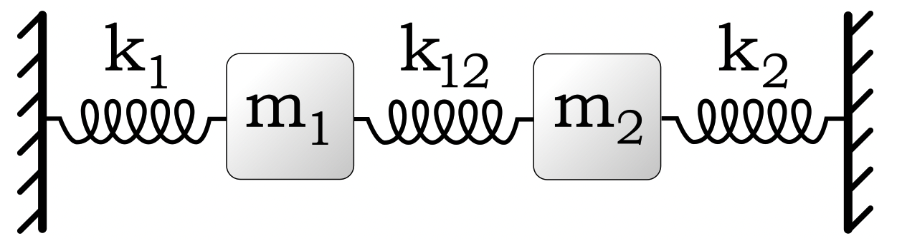

# Oscillations and Waves

Course [home page](./)

## Daily Schedule Term 4

See also [Daily Schedule Term 5](./daily_schedule_term_5.html)

### Week 1 &mdash; Lightning Introduction to Mathematica Notebooks &mdash; Velocity of a Particle

* Tuesday, Jan. 14 &mdash; Preparation for class: Study Sections 1-3 of [*An Elementary Introduction to the Wolfram Language, 3rd Edition*](https://www.wolfram.com/language/elementary-introduction/3rd-ed/index.html.en), hereafter abbreviated *EIWL3* &mdash; Expressions, operator precedence, symbolic manipulation, built-in functions, and user-defined functions in Mathematica &mdash; We will work through a little demonstration called *[Heads or Tails](./demonstrations/HeadsOrTails.nb.pdf)* which demonstrates user-defined functions and nested functions
* Friday, Jan. 17 &mdash; Problem Set 1: Solve all Sections 1-4 of *EIWL3* &mdash; *[PS1 Solution](./solutions/brian54321/Brian-PS02.nb.pdf)* &mdash; We learned four more notebook features that greatly enhance readability: plain text cells, section cells, subsection cells, and comments in code &mdash; In class, we worked through a small but critical bit of physics, *[Position from Velocity &mdash; Theory](./theory/PositionFromVelocity-Theory.nb.pdf)* &mdash; We manually filled out a *[Position from Velocity - Constant Acceleration](./worksheets/00-PositionFromVelocity-ConstantAccelerationWorksheet.pdf)* worksheet that demonstrates the theory we have developed so far for the case of linearly increasing velocity (aka constant acceleration or uniform acceleration)

### Week 2 &mdash; Acceleration of a Particle &mdash; Newton's 2nd Law &mdash; Interesting Complications

* Tuesday, Jan. 21 &mdash; Problem Set 2: Solve all of the exercises from Sections 5-8 of *EIWL3* &mdash; *[PS2 Solution](./solutions/brian54321/Brian-PS02.nb.pdf )* &mdash; Look ahead to Section 9 of *EIWL3* &mdash; In class: We completed the *[Position from Velocity - Constant Acceleration](./worksheets/01-PositionFromVelocity-ConstantAcceleration.nb.pdf)* notebook
* Friday, Jan. 24 &mdash; Problem Set 3: Solve all the exercises from Sections 9, 10, and the first half of Section 11 (Exs. 11.1 to 11.15) &mdash; *[PS3 Solution](./solutions/brian54321/Brian-PS03.nb.pdf)* &mdash; In-class: We will develop *[Velocity from Acceleration - Theory](./theory/VelocityFromAcceleration-Theory.nb.pdf)* and combine this with the theory we already developed for obtaining position from velocity &mdash; In other words, we will transitively obtain velocity from acceleration and then position from velocity &mdash; We will start to see how interesting complications can arise &mdash; Finally, in class, we will complete the *[Velocity from Acceleration - Sinusoidal Force](./worksheets/02-VelocityFromAcceleration-SinusoidalForce.nb.pdf)* notebook

### Week 3 &mdash; Second-Order Runge-Kutta &mdash; Mass on a Spring &mdash; Damped Oscillation

* Wednesday, Jan. 29 &mdash; Problem Set 4: Solve the rest of the exercises from Section 11 (Exs. 11.16 to 11.31), Section 12, and Section 13 &mdash; *[PS4 Solution](./solutions/brian54321/Brian-PS04.nb.pdf)* &mdash; In-class: Develop *[Second-Order Runge-Kutta - Theory](./theory/RungeKutta2-Theory.nb.pdf)* and then complete the *[Second-Order Runge-Kutta - Mass on a Spring](./worksheets/03-RungeKutta2-MassOnASpring.nb.pdf)* notebook &mdash; Period *(T)*, frequency *(f=1/T)*, and angular frequency *(&omega;=2&pi; f)*
* Friday, Jan. 31 &mdash; No new assignment in *EIWL3* &mdash; In-class: Develop *[General Second-Order Runge-Kutta - Theory](./theory/GeneralRungeKutta2-Theory.nb.pdf)* and then complete the *[General Second-Order Runge-Kutta - Damped Oscillation](./worksheets/04-GeneralRungeKutta2-DampedOscillation.nb.pdf)* notebook

### Week 4 &mdash; Forced Oscillation &mdash; Resonance &mdash; Damped Pendulum &mdash; Animated Graphics

* Tuesday, Feb. 4 &mdash; Problem Set 5: Do the Exercises from Sections 14 and 17 &mdash; *[PS5 Solution](./solutions/brian54321/Brian-PS05.nb.pdf)* &mdash; Additionally, instead of turning in the exercises from Sections 15 and 16, explore Mathematica and choose any topic on which to give a presentation &mdash; In-class: We will flesh out a little more of the [General Second-Order Runge-Kutta - Best Estimate of Average](./theory/GeneralRungeKutta2-BestEstimateOfAverage.nb.pdf) and then proceed to your
* Friday, Feb. 7 &mdash; Instead of a new Problem Set: Before class, have the *[General Second-Order Runge-Kutta - Forced Oscillation](./worksheets/05-GeneralRungeKutta2-ForcedOscillation.nb.pdf)* notebook working &mdash; In-class: We will use the notebook you finished before class to analyze resonance &mdash; Develop theory to transition from the damped oscillator to the damped pendulum &mdash; *[Damped Oscillator to Damped Pendulum - Theory](./theory/DampedOscillatorToDampedPendulum-Theory.nb.pdf)* which introduces Angle, Angular Velocity, Angular Acceleration, and the Approximate Theoretical Solution &mdash; In-class: Start completing *[Damped Pendulum - With Animated Graphics](./worksheets/06-DampedPendulum-WithAnimatedGraphics.nb.pdf)* notebook

### Week 5 &mdash; Forced Pendulum &mdash; Phase Space &mdash; Chaos &mdash; Exam 1

* Tuesday, Feb. 11 &mdash; Problem Set 6: Re-download *[Damped Pendulum - With Animated Graphics](./worksheets/06-DampedPendulum-WithAnimatedGraphics.nb.pdf)* notebook that we started in the last class and finish it &mdash; *[PS6 Solution](./solutions/brian54321/Brian-PS06.nb.pdf)* &mdash; Problem Set 7: Do the exercises from *EIWL3* Sections 18 and 19 &mdash; *[PS7 Solution](./solutions/brian54321/Brian-PS07.nb.pdf)* &mdash; In-class: Examine *[Forced Pendulum - Phase Space - Chaos](./worksheets/07-ForcedPendulum-PhaseSpace-Chaos.nb.pdf)* notebook
* Friday, Feb. 14 &mdash; *[Exam 1 - Naval Battle](./exams/Exam1.nb.pdf)* &mdash; *[Exam 1 Solution](./solutions/brian54321/Brian-Exam1.nb.pdf)*

### Week 6 &mdash; Systems with Two Masses and Systems with Many Masses

#### *EIWL3* Section 20, Section 23, Sections 25-34, and Sections 38-41 are when we get to the grammar and a significantly more advanced understanding of the Wolfram Language

* Tuesday, Feb. 18 &mdash; Problem Set 8: Do the Exercises from *EIWL3* Sections 20, 21, and 22 &mdash; In-class: Develop *[Coupled Harmonic Oscillators - Theory](./theory/CoupledHarmonicOscillators-Theory.nb.pdf)* and then complete the *[Coupled Harmonic Oscillators](./worksheets/08-CoupledHarmonicOscillators.nb.pdf)* notebook

#### Plans for upcoming classes are subject to adjustment, depending especially on the actual pace of the previous classes

* Friday, Feb. 21 &mdash; Problem Set 9: Do the Exercises from *EIWL3* Sections 23, 24, and 25 &mdash; In-Class: Many Coupled Harmonic Oscillators

### Week 7 &mdash; Compound Pendulum

* Tuesday, Feb. 25 &mdash; Problem Set 10: Do the Exercises from *EIWL3* Sections 26, 27, and 28 &mdash; In-Class: Compound Pendulum

## Daily Schedule Term 5

### Week 8

* Tuesday, March 18
* Friday, March 21

### Week 9

* Tuesday, March 25
* Friday, March 28

### Week 10

* Tuesday, April 1
* Friday, April 4

