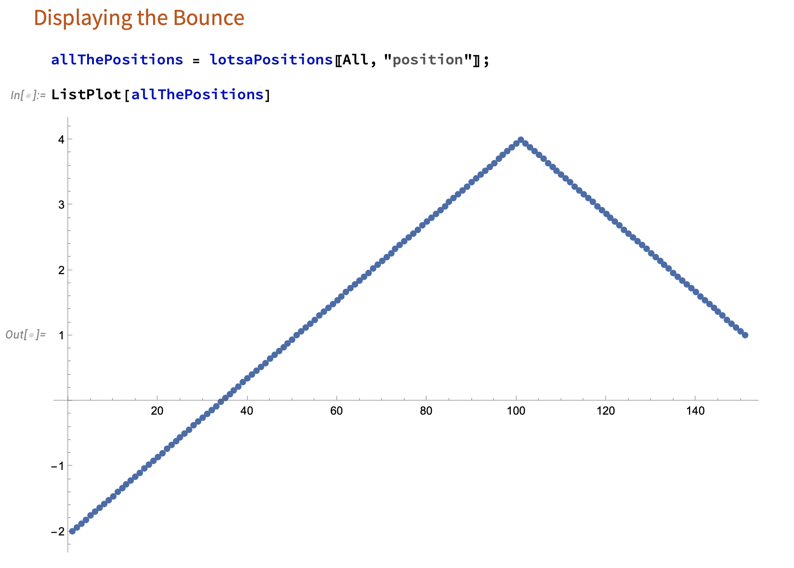

# Oscillations and Waves

Course [home page](./)

## Daily Schedule Term 4

### Week 1 &mdash; Lightning Introduction to Mathematica Notebooks &mdash; Displaying Motion

* Tuesday, Jan. 14 &mdash; Preparation for class: Study Sections 1-3 of [*An Elementary Introduction to the Wolfram Language, 3rd Edition*](https://www.wolfram.com/language/elementary-introduction/3rd-ed/index.html.en), hereafter abbreviated *EIWL3* &mdash; Expressions, operator precedence, symbolic manipulation, built-in functions, and user-defined functions in Mathematica &mdash; We will work through a little demonstration called *[Heads or Tails](./demonstrations/HeadsOrTails.nb.pdf)* which demonstrates user-defined functions and nested functions
* Friday, Jan. 17 &mdash; Assignment for Friday, Jan. 17: Before Friday's class, create and email me a notebook that solves *all* of the exercises from Sections 1-4 of *EIWL3* &mdash; We learned four more notebook features that greatly enhance readability: plain text cells, section cells, subsection cells, and comments in code &mdash; In class, we worked through a small but critical bit of physics, *[Position from Velocity &mdash; Theory](./demonstrations/PositionFromVelocity-Theory.nb.pdf)* &mdash; We manually filled out a worksheet that demonstrates this theory using linearly increasing velocity (aka uniform acceleration)

### Week 2 &mdash; Acceleration &mdash; Newton's Laws of Motion

* Tuesday, Jan. 21 &mdash; Assignment for Tuesday, Jan. 21: Before Tuesday's class, create and email me a notebook that solves *all* of the exercises from Sections 5-8 of *EIWL3* &mdash; Look ahead to Section 9 of *EIWL3* &mdash; In class: We will work through *[Position from Velocity &mdash; Using Associations](./demonstrations/PositionFromVelocity-UsingAssociations.nb.pdf)* &mdash; If there is time in class, we can start on both of Friday's assignments

#### Plans for upcoming classes are subject to adjustment, depending especially on the actual pace of the previous classes

* Friday, Jan. 24 &mdash; Before Friday's class, create and email me a notebook that solves all the exercises from Sections 9-12 of *EIWL3* &mdash; Also as part of Friday's assignment, in a second notebook, convert my *Position from Velocity &mdash; Using Associations* to a new notebook *Position from Velocity &mdash; Using Lists,* and email me that notebook before class on Friday

### Week 3

* Tuesday, Jan. 28
* Friday, Jan. 31

### Week 4

* Tuesday, Feb. 4
* Friday, Feb. 7

### Week 5

* Tuesday, Feb. 11
* Friday, Feb. 14

### Week 6

* Tuesday, Feb. 18
* Friday, Feb. 21

### Week 7

* Tuesday, Feb. 25
* Friday, Feb. 28 &mdash; No class &mdash; Shakespeare 2.0 Festival Feb. 26-28

