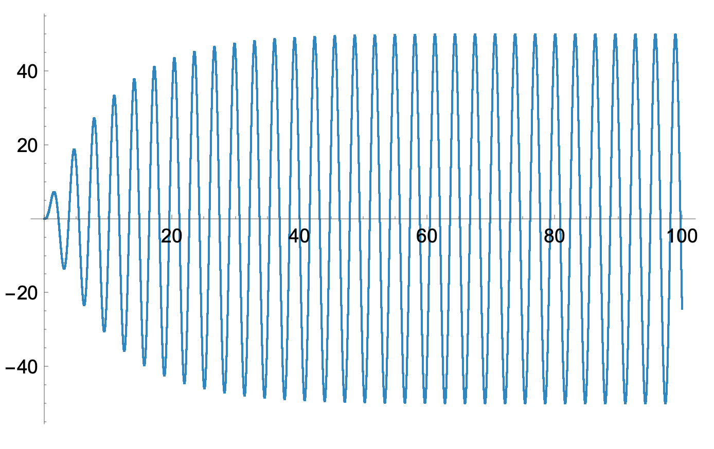

# Oscillations and Waves

Course [home page](./)

## Daily Schedule Term 4

See also [Daily Schedule Term 5](./daily_schedule_term_5.html)

### Week 1 &mdash; Lightning Introduction to Mathematica Notebooks &mdash; Velocity

* Tuesday, Jan. 14 &mdash; Preparation for class: Study Sections 1-3 of [*An Elementary Introduction to the Wolfram Language, 3rd Edition*](https://www.wolfram.com/language/elementary-introduction/3rd-ed/index.html.en), hereafter abbreviated *EIWL3* &mdash; Expressions, operator precedence, symbolic manipulation, built-in functions, and user-defined functions in Mathematica &mdash; We will work through a little demonstration called *[Heads or Tails](./demonstrations/HeadsOrTails.nb.pdf)* which demonstrates user-defined functions and nested functions
* Friday, Jan. 17 &mdash; Problem Set 1: Solve all Sections 1-4 of *EIWL3* &mdash; [PS01 Solution](./solutions/2025-01-17/Brian-PS01.nb.pdf) &mdash; We learned four more notebook features that greatly enhance readability: plain text cells, section cells, subsection cells, and comments in code &mdash; In class, we worked through a small but critical bit of physics, *[Position from Velocity &mdash; Theory](./theory/PositionFromVelocity-Theory.nb.pdf)* &mdash; We manually filled out a *[Position from Velocity - Constant Acceleration](./worksheets/PositionFromVelocity-ConstantAccelerationWorksheet.pdf)* worksheet that demonstrates the theory we have developed so far for the case of linearly increasing velocity (aka constant acceleration or uniform acceleration)

### Week 2 &mdash; Acceleration &mdash; Newton's 2nd Law &mdash; Interesting Complications

* Tuesday, Jan. 21 &mdash; Problem Set 2: Solve all of the exercises from Sections 5-8 of *EIWL3* &mdash; [PS02 Solution](./solutions/2025-01-21/Brian-PS02.nb.pdf) &mdash; Look ahead to Section 9 of *EIWL3* &mdash; In class: We completed the *[Position from Velocity - Constant Acceleration](./worksheets/PositionFromVelocity-ConstantAcceleration.nb.pdf)* notebook
* Friday, Jan. 24 &mdash; Problem Set 3: Solve all the exercises from Sections 9, 10, and the first half of Section 11 (Exs. 11.1 to 11.15) &mdash; In-class: We will develop *[Velocity from Acceleration - Theory](./theory/VelocityFromAcceleration-Theory.nb.pdf)* and combine this with the theory we already developed for obtaining position from velocity &mdash; In other words, we will transitively obtain velocity from acceleration and then position from velocity &mdash; We will start to see how interesting complications can arise &mdash; Finally, in class, we will complete the *[Velocity from Acceleration - Sinusoidal Force](./worksheets/VelocityFromAcceleration-SinusoidalForce.nb.pdf)* notebook

### Week 3 &mdash; Second-Order Runge-Kutta &mdash; Mass on  a Spring &mdash; Damped Oscillation

* Wednesday, Jan. 29 &mdash; Problem Set 4: Solve the rest of the exercises from Section 11 (Exs. 11.16 to 11.31), Section 12, and Section 13 &mdash; In-class: Develop *[Second-Order Runge-Kutta - Theory](./theory/RungeKutta2-Theory.nb.pdf)* and then complete the *[Second-Order Runge-Kutta - Mass on a Spring](./worksheets/RungeKutta2-MassOnASpring.nb.pdf)* notebook &mdash; Period *(T)*, frequency *(f=1/T)*, and angular frequency *(&omega;=2&pi; f)*
* Friday, Jan. 31 &mdash; No new assignment in *EIWL3* &mdash; In-class: Develop *[General Second-Order Runge-Kutta - Theory](./theory/GeneralRungeKutta2-Theory.nb.pdf)* and then complete the *[General Second-Order Runge-Kutta - Damped Oscillation](./worksheets/GeneralRungeKutta2-DampedOscillation.nb.pdf)* notebook

### Week 4 &mdash; Forced Oscillation &mdash; Resonance &mdash; Pendulum &mdash; Phase Space

* Tuesday, Feb. 4 &mdash; EIWL3 Assignment: Stay tuned, but probably Sections 14-16? &mdash; In-class: Complete the *[General Second-Order Runge-Kutta - Forced Oscillation](./worksheets/GeneralRungeKutta2-ForcedOscillation.nb.pdf)* notebook &mdash; Explore Resonance

#### Plans for upcoming classes are subject to adjustment, depending especially on the actual pace of the previous classes

* Friday, Feb. 7 &mdash; Pendulum - Theory (Angle, Angular Velocity, Angular Acceleration)

### Week 5 &mdash; Forced Pendulum &mdash; Chaos &mdash; Exam 1

* Tuesday, Feb. 11 &mdash; Forced Pendulum &mdash; Chaos
* Friday, Feb. 14 &mdash; Exam 1

### Week 6

* Tuesday, Feb. 18
* Friday, Feb. 21

### Week 7

* Tuesday, Feb. 25
* Friday, Feb. 28 &mdash; No class &mdash; Shakespeare 2.0 Festival Feb. 26-28
