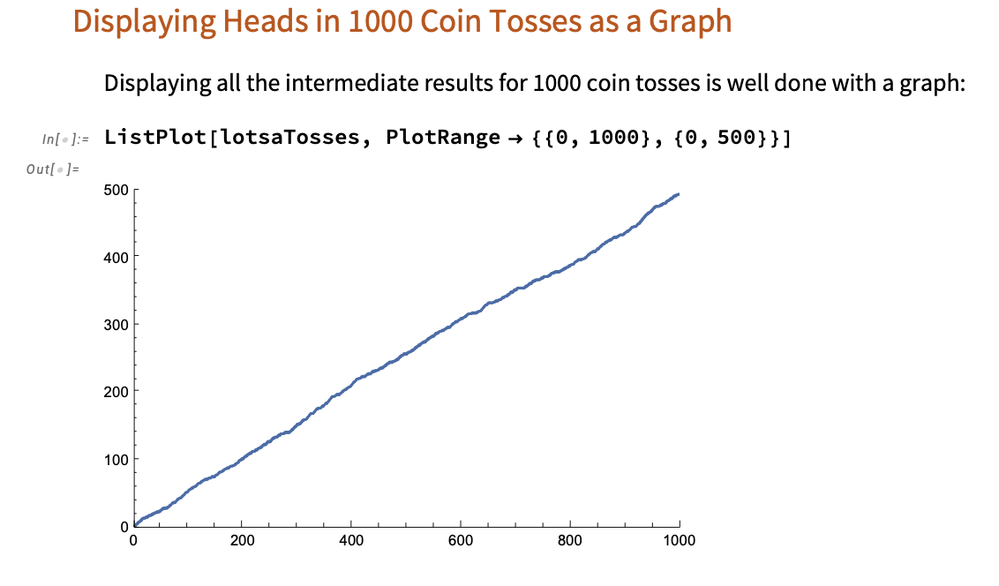

# Oscillations and Waves

Course [home page](./)

## Daily Schedule Term 4

### Week 1 &mdash; Lightning Introduction to Mathematica Notebooks &mdash; Displaying Motion

* Monday, Jan. 13 &mdash; Preparation for class: Study Sections 1-3 of [*An Elementary Introduction to the Wolfram Language, 3rd Edition*](https://www.wolfram.com/language/elementary-introduction/3rd-ed/index.html.en), hereafter abbreviated *EIWL3* &mdash; In class, we will work through a little demonstration that builds on these sections called *[Heads or Tails](./demonstrations/HeadsOrTails.nb.pdf)*

#### Problem sets will generally be turned by email using Mathematica notebooks. The last step in your process before you submit a notebook as your solution is to quit the Mathematica kernel, and then re-execute your entire notebook with a fresh kernel. Assuming your notebook executes reproducibly and without error with a fresh kernel, you have something you can turn in. If it doesn't execute reproducibly and without error, find and fix the problems, and repeat this process until it does.

* Thursday, Jan. 16 &mdash; Assignment for Thursday, Jan. 16: Before Thursday's class, create and email me a notebook that solves *all* of the problems from Sections 1-4 of *EIWL3* &mdash; Preparation for class: Look ahead to Sections 5 and 6 of *EIWL3* &mdash; In class, we will work through a little demonstration that is our first example of displaying motion, and we will display it as a graph

### Week 2

* Monday, Jan. 20 &mdash; Assignment for Thursday, Jan. 16: Before Monday's class, create and email me a notebook that solves all the problems from Sections 5-8 of *EIWL3* &mdash; Preparation for class: Look ahead to Section 9 of *EIWL3*
* Thursday, Jan. 23

### Week 3

* Monday, Jan. 27
* Thursday, Jan. 30

### Week 4

* Monday, Feb. 3
* Thursday, Feb. 6

### Week 5

* Monday, Feb. 10
* Thursday, Feb. 13

### Week 6

* Monday, Feb. 17
* Thursday, Feb. 20

### Week 7

* Monday, Feb. 24
* Thursday, Feb. 27

