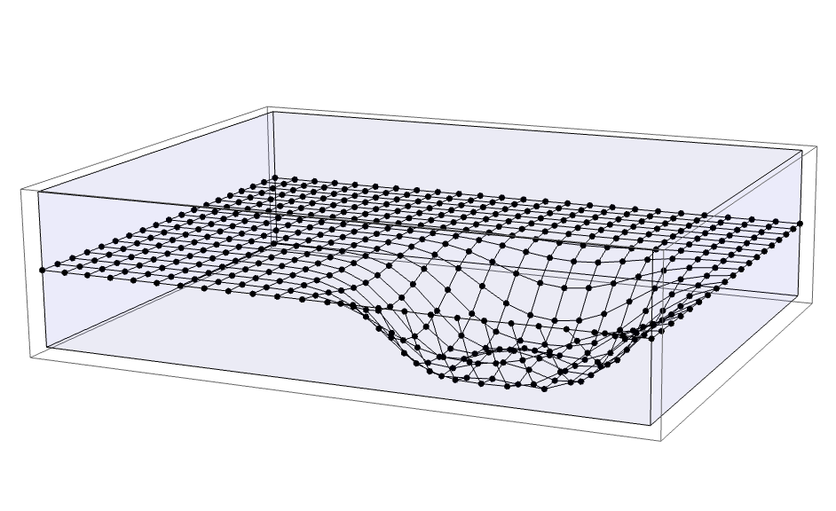
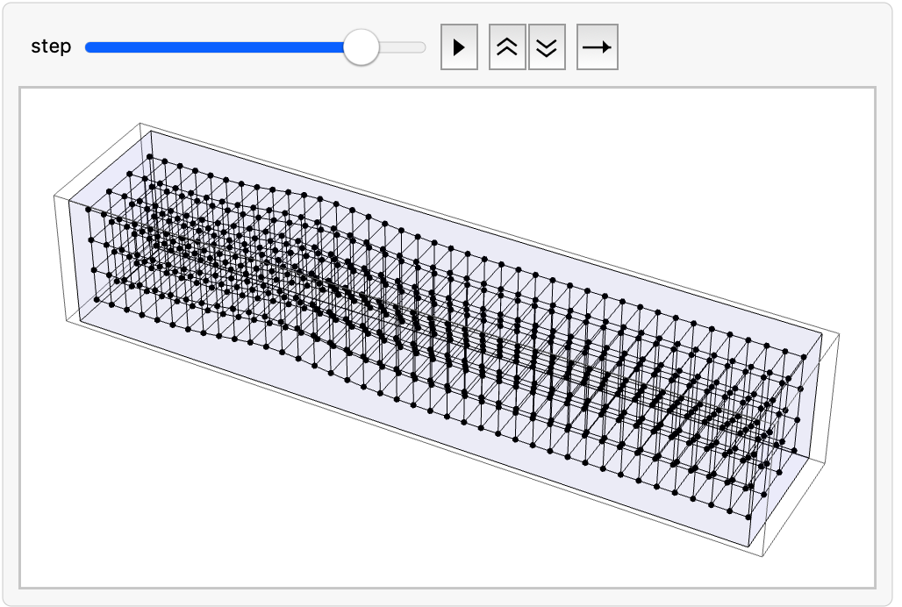
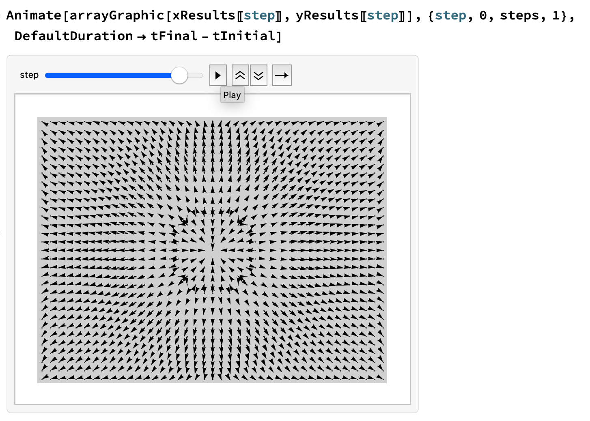

# Oscillations and Waves

Course [home page](./)

## Daily Schedule Term 5

See also [Daily Schedule Term 4](./daily_schedule_term_4.html)

### Week 8 &mdash; Torsion Pendulum &mdash; Coupled Torsion Pendula &mdash; The Second Derivative &mdash; Torsion Waves

#### As a way of refreshing on material that is three weeks old due to the Term 4-5 break, our eleventh and twelfth notebooks (Torsion Pendulum and Coupled Torsion Pendula) are straightforward recapitulations of our third and eighth notebooks (Mass on a Spring and Coupled Harmonic Oscillators). Similarly, our thirteenth notebook (Torsion Waves) will be a straightforward recapitulation of our ninth notebook (Many Harmonic Oscillators), but we will press on the initial conditions harder and get obvious traveling waves to appear. Also, we are about to start making a connection to an important calculus idea, &ldquo;The Second Derivative.&rdquo; Waves typically show up in systems for which Newton's Laws involve second derivatives with respect to both space and time. 

* Tuesday, March 18 &mdash; Problem Set 11: Do the Exercises from *EIWL3* Sections 29 and 30 &mdash; In-Class: Complete the *[Torsion Pendulum](./worksheets/11-TorsionPendulum.nb.pdf)* and *[Coupled Torsion Pendula](./worksheets/12-CoupledTorsionPendula.nb.pdf)* notebooks
* Friday, March 21 &mdash; Problem Set 12: Do the Exercises from *EIWL3* Sections 31 and 32 &mdash; In-Class: Develop *[Torsion Waves - Theory](./theory/TorsionWaves-Theory.nb.pdf),* complete the *[Torsion Waves](./worksheets/13-TorsionWaves.nb.pdf)* notebook, and then develop *[The Second Derivative](./theory/TheSecondDerivative.nb.pdf)*

### Week 9 &mdash; Drumheads &mdash; Two-Dimensional Grids of Masses

* Tuesday, March 25 &mdash; Problem Set 13: Do the Exercises from *EIWL3* Sections 33 and 34 &mdash; In-Class: Complete the [Rectangular Drumhead](./worksheets/14-RectangularDrumhead.nb.pdf) notebook which models a drumhead with a rectangular grid of masses

#### Rectangular Drumhead Mallet Strike

* Friday, March 28 &mdash; Problem Set 14: Do the Exercises from *EIWL3* Sections 35 and 36 &mdash;  and then complete the [Circular Drumhead](./worksheets/15-CircularDrumhead.nb.pdf) notebook which models a drumhead with a circular grid of masses

### Week 10 &mdash; Three-Dimensional Grid of Masses &mdash; Exam 2

* Tuesday, April 1 &mdash; Problem Set 15: Do the Exercises from *EIWL3* Sections 37 and 38 &mdash; In-Class: Let's attempt to consolidate our understanding or at least record in one place the [Drumheads — Theory](./theory/Drumheads-Theory.nb.pdf) that we have been using, which now includes the ideas of longitudinal and transverse waves and then complete the [Cubical Grid of Masses - Transverse Waves](./worksheets/16-CubicalGridOfMasses-TransverseWaves.nb.pdf), and finally discuss what Friday's exam will cover (obviously we have covered so much since Exam 1, it would be unfair and impossible to comprehensively test it)

#### Transverse Wave Transiting With Periodic Boundary Conditions

* Friday, April 4 &mdash; *[Exam 2 - Longitudinal (Compression) Waves](./exams/Exam2.nb.pdf)* &mdash; *[Exam 2 Solution](./solutions/brian54321/Brian-Exam2.nb.pdf)* (much of the exam will involve things similar to what you did in the transverse waves notebook) &mdash; Check out the next problem set and do it before the exam (even though it isn't officially due until April 8)

#### Longitudinal (Compression) Wave

#### We have a little less than one-third of the course left, and we are going to blast into the stratosphere: instead of doing large numbers of particles &mdash; like 72 rods or a grid of 18 by 24=432 masses &mdash; we are going to take the limit that *n&rarr;&infin;* and start specifying problems to Mathematica using the notation of derivatives. You might reasonably ask that if it is too time-consuming for Mathematica to do, say, a thousand particles for ten-thousand time steps, how is Mathematica going to cope with continuous systems which have an infinite number of particles? The answer is that deep under the hood, it breaks continuous systems up into little chunks and little time steps just as we have been chunking up the world with grids and time steps. In other words, Mathematica also turns continuous problems back into problems with a large but finite number of chunks and time steps. However, from now on in this course, Mathematica is going to hide the need to break continuous systems up into little chunks from us. Mathematica draws graphs and creates animations by choosing the chunks and the time steps to be so small that we don't generally perceive them unless we blow up the graphics to a large size. Sometimes, the chunkiness leaks through enough to be obvious, but if that happens and we are not satisfied, we can order Mathematica to use finer chunks and finer time steps. Of course, the processor in your laptop may not appreciate this, but if you are patient with your computer's processor, and also if your computer has enough memory to hold the intermediate results, there is no limit in principle to how accurately computers can do simulations &mdash; the only exceptions being simulations with chaos or singularities, and even in such situations, simulations are often informative and indicative of what happens in the real world. All that said, the limits of computer power are real, and are part of the reason why we do not yet have compelling simulations for things like the formation of the solar system, even using the largest supercomputers available.

### Week 11 &mdash; Continuous Systems from the *n&rarr;&infin;* Limit &mdash; Oscillators and Guitar Strings

* Tuesday, April 8 &mdash; Problem Set 16: Make a Wolfram language notebook containing a compilation of fundamental, low-level syntax and functions (such as @@, @@@, /@ ./, Table, Array, Module, etc.) and email it to me before or after Friday's exam &mdash; I will post everyone's cheat cheets ([Brian's - which will have more and more added to it over time](./cheat-sheets/WolframLanguageCheatSheet-Brian.nb.pdf), [Eli's](./cheat-sheets/WolframLanguageCheatSheet-Eli.nb.pdf), [Harper's](./cheat-sheets/WolframLanguageCheatSheet-Harper.nb.pdf), [Hexi's](./cheat-sheets/WolframLanguageCheatSheet-Hexi.nb.pdf), [Jeremy's](./cheat-sheets/WolframLanguageCheatSheet-Jeremy.nb.pdf), [Rania's](./cheat-sheets/WolframLanguageCheatSheet-Rania.nb.pdf), [Tahm's](./cheat-sheets/WolframLanguageCheatSheet-Tahm.nb.pdf), and [Walker's](./cheat-sheets/WolframLanguageCheatSheet-Walker.nb.pdf) &mdash; In-class: Present the [Harmonic Oscillator Redux](./worksheets/17-HarmonicOscillatorRedux.nb.pdf) notebook (this time letting Mathematica do all the hard work)

#### Driven Harmonic Oscillator Just Above Resonance

* Friday, April 11 &mdash; Problem Set 17: Do the Exercises from *EIWL3* Sections 39 and 40 &mdash; In-class: Complete the [Guitar String](./worksheets/18-GuitarString.nb.pdf) notebook (the math is a lot like torsion waves, but the new thing is that again we are going to be letting Mathematica do all the hard work) &mdash; If there is spare time, we will use it to launch into the special projects

#### Special projects being presented in Weeks 12 and 13

* Jeremy and Eli: Popluation dynamics or other evolution or biology problem that you come up with consulting Andy
* Walker and Hexi: An economics or high finance problem
* Rania: Liquid drop model of fission (Brian will assist &mdash; the liquid drop is going to be tricky!)
* Harper and Tahm: Ballistics calculations

Each special project presentation should include a Mathematica notebook that has a description of what you are solving, is interleaved with explanations of how your code solves it, and ideally, has activities for the rest of us to do to help us become familiar with the problem and your technique. Email your notebook to the class before your presentation. Use notebook chapters, section, and subsections, and other typesetting features to make your presentation organized and professional-looking. Email your presentation to all of us just before the class on the day you are presenting.

### Week 12 &mdash; Drumheads &mdash; Diffusion of Heat

#### Plans for upcoming classes are subject to adjustment, depending especially on the actual pace of the previous classes.

* Tuesday, April 15 &mdash; Problem Set 18: Do the exercises from *EIWL3* Sections 41 and 42  &mdash; Complete the [Rectangular Drumhead Redux] (./worksheets/19-RectangularDrumheadRedux.nb.pdf) notebook [Circular Drumhead Redux] (./worksheets/20-CircularDrumheadRedux.nb.pdf) notebooks &mdash; Presentation: Jeremy and Eli's presentation on population dynamics or other biology problem
* Friday, April 18 &mdash; Problem Set 19: Do the exercises from *EIWL3* Sections 43 and 44 &mdash; Diffusion in one dimension (some of the same features appear in diffusion as in waves) &mdash; Presentation: Rania's presention on the liquid drop model of fission

### Week 13 &mdash; Diffusion of Pollutants in Two or Three Dimensions &mdash; Schrodinger's Equation

* Tuesday, April 22 &mdash; Problem Set 20: Do the exercises from *EIWL3* Sections 45 and 46 &mdash; Diffusion in three dimensions &mdash; Presentation: Walker and Hexi's presentation on an economics or high finance problem
* Friday, April 25 &mdash; Problem Set 21: Do the exercises from *EIWL3* Sections 47 and 48 &mdash; Quantum-mechanical particle confined to a box &mdash; Presentation: Harper and Tahm's presentation on ballistics

### Week 14 &mdash; Exam 3 &mdash; Atomic Wave Functions

* Tuesday, April 29 &mdash; Exam 3 (Designed to only take about 45 minutes) &mdash; Problems will be like exercises from *EIWL3,* especially those that use your understanding of the core functionality (Map, Apply, virtual functions), rather than your understanding of specialized library functions (like GeoGraphics, WikipediaData, etc.)
* Friday, May 2 &mdash; No Problem Set :) &mdash; In-Class: The s, p, d, and f Orbitals of Hydrogen
