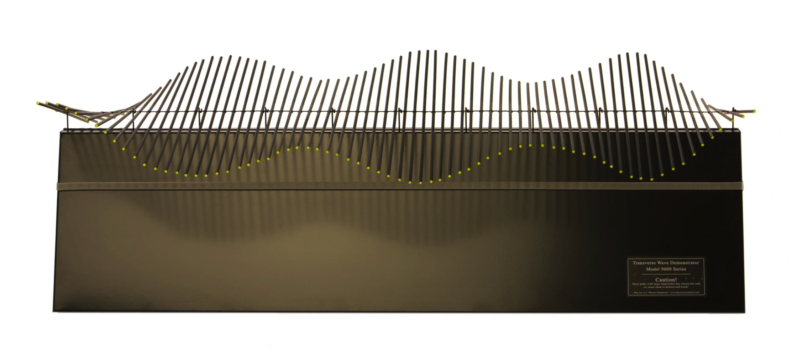

# Oscillations and Waves

Course [home page](./)

## Daily Schedule Term 5

See also [Daily Schedule Term 4](./daily_schedule_term_4.html)

### Week 8 &mdash; Torsion Pendulum &mdash; Coupled Torsion Pendula &mdash; The Second Derivative &mdash; Torsion Waves

#### As a way of refreshing on material that is three weeks old due to the Term 4-5 break, our eleventh and twelfth notebooks (Torsion Pendulum and Coupled Torsion Pendula) are straightforward recapitulations of our third and eighth notebooks (Mass on a Spring and Coupled Harmonic Oscillators). Similarly, our thirteenth notebook (Torsion Waves) will be a straightforward recapitulation of our ninth notebook (Many Harmonic Oscillators), but we will press on the initial conditions harder and learn how to get waves that are not jumbled to appear. Also, we are about to start making a connection to an important calculus idea, &ldquo;The Second Derivative.&rdquo; Wave phenomena typically show up in systems for which Newton's Laws involve second derivatives with respect to both space and time. 

* Tuesday, March 18 &mdash; Problem Set 11: Do the Exercises from *EIWL3* Sections 29 and 30 &mdash; In-Class: Complete the *[Torsion Pendulum](./worksheets/11-TorsionPendulum.nb.pdf)* and *[Coupled Torsion Pendula](./worksheets/12-CoupledTorsionPendula.nb.pdf)* notebooks
* Friday, March 21 &mdash; Problem Set 12: Do the Exercises from *EIWL3* Sections 31 and 32 &mdash; In-Class: Develop *[Torsion Waves - Theory - The Second Derivative](./theory/TorsionWaves-Theory-TheSecondDerivative.nb.pdf)* and then complete the *[Torsion Waves](./worksheets/13-TorsionWaves.nb.pdf)* notebook

#### Torsion Wave Apparatus

### Week 9 &mdash; Two-Dimensional Grids of Masses

#### Plans for upcoming classes are subject to adjustment, depending especially on the actual pace of the previous classes.

* Tuesday, March 25 &mdash; Problem Set 13: Do the Exercises from *EIWL3* Sections 33 and 34 &mdash; In-Class: Square Grid of Masses
* Friday, March 28 &mdash; Problem Set 14: Do the Exercises from *EIWL3* Sections 35 and 36 &mdash; In-Class: Radial Grid of Masses

### Week 10 &mdash; Three-Dimensional Grid of Masses &mdash; Exam 2

* Tuesday, April 1 &mdash; Problem Set 15: Do the Exercises from *EIWL3* Sections 37 and 38 &mdash; Cubical Grid of Masses
* Friday, April 4 &mdash; Exam 2

### Week 11 &mdash; Continuous Systems from the *n&rarr;&infin;* Limit &mdash; Guitar Strings and Drumheads

#### We have a little less than one-third of the course left, and we are going to blast into the stratosphere: instead of doing large numbers of particles &mdash; like 72 rods or 100 masses &mdash; we are going to take the limit that *n&rarr;&infin;.* and start describing problems in terms of derivatives. You might reasonably ask that if it is too time-consuming for Mathematica to do, say, a million particles for ten-thousand time steps, how is Mathematica going to cope with continuous systems which have an infinite number of particles? The answer is that deep under the hood, it breaks continuous systems up into little chunks just as we have been chunking up the world by simulating continuous systems with large numbers of small masses. In other words, Mathematica also turns continuous problems back into problems with a large but finite number of chunks. However, from now on in this course, Mathematica is going to hide its need to break the world up into little chunks from us. Also, in a real system, there is an infinity of possible times that exist in any time interval, but we have been breaking the time interval up into a finite number of time steps. It is similarly well within Mathematica's repertoire to hide from us its need to break continuous time up into time steps. Mathematica draws graphs and creates animations by choosing the chunks and the time steps to be so small that we cannot perceive them unless we blow up the graphics to a large size. Sometimes, the chunkiness leaks through enough to be obvious in the graphics, but if that happens and we are not satisfied, we can order Mathematica to use finer grids and finer time steps. Of course, the processor in your laptop may not appreciate this, but if you are patient with your computer's processor, and also if your computer has enough memory to hold the intermediate results, there is no limit to how accurately Mathematica can do most simulations — the only exceptions being simulations with chaos or singularities, and even in these extreme situations, simulations are often informative and indicative of what happens in the real world. All that said, the limits of computer power are real, and are part of the reason why we do not yet have compelling simulations for things like the formation of the solar system, even using the largest supercomputers available.

* Tuesday, April 8 &mdash; Problem Set 16: TBD! &mdash; Guitar Strings
* Friday, April 11 &mdash; Problem Set 17: Do the Exercises from *EIWL3* Sections 39 and 40 &mdash; Drumheads

### Week 12 &mdash; Sound Waves &mdash; Diffusion of Heat in a Rod

* Tuesday, April 15 &mdash; Problem Set 18: Do the Exercises from *EIWL3* Sections 41 and 42  &mdash; Sound Waves
* Friday, April 18 &mdash; Problem Set 19: Do the Exercises from *EIWL3* Sections 43 and 44 &mdash; Diffusion in One Dimension

### Week 13 &mdash; Diffusion of Pollutants &mdash; Schrodinger's Equation

* Tuesday, April 22 &mdash; Problem Set 20: Do the Exercises from *EIWL3* Sections 45 and 46 &mdash; Diffusion in Three Dimensions
* Friday, April 25 &mdash; Problem Set 21: Do the Exercises from *EIWL3* Sections 47 and 48 &mdash; *Quantum-Mechanical Particle Confined to a Box

### Week 14 &mdash; Exam 3 &mdash; Atomic Wave Functions

* Tuesday, April 29 &mdash; Exam 3
* Friday, May 2 &mdash; No Problem Set :) &mdash; In-Class: The s, p, d, and f Orbitals of Hydrogen
